# Translator App


A versatile and feature-rich translator application for Android, designed to break down language barriers with ease. This app provides multiple modes of translation including text, real-time camera, and conversation, making it a powerful tool for communication.

## ✨ Features

* **Text Translation**: Quickly translate typed or pasted text between a wide variety of languages.
* **Camera Translation**: Use your device's camera to instantly translate text from images in real-time.
* **Conversation Mode**: Engage in bilingual conversations with a split-screen interface that translates speech for both participants.
* **Image Translation**: Select an image from your gallery to detect and translate text within it.
* **Translation History**: Automatically saves your past translations for easy access and review.
* **Bookmarks**: Save important or frequently used translations for quick retrieval.
* **Text-to-Speech**: Listen to the pronunciation of both the original and translated text.
* **Clean & Intuitive UI**: A modern, user-friendly interface built with Material Design principles for a seamless experience.

## 📸 Screenshots

### Main Features

| Home Screen                                       | Conversation                                          | Translation Result                                    |
| ------------------------------------------------- | ----------------------------------------------------- | ----------------------------------------------------- |
| 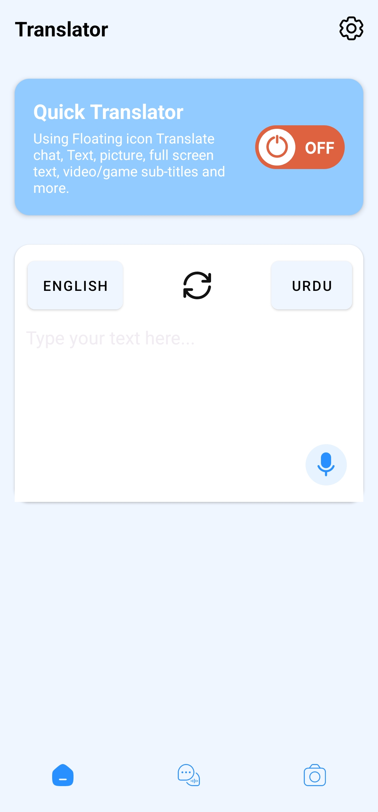 | 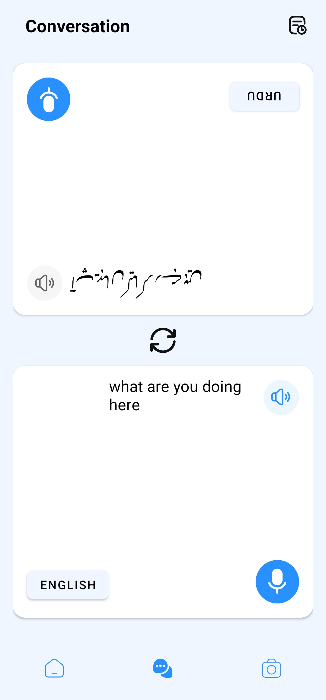 | 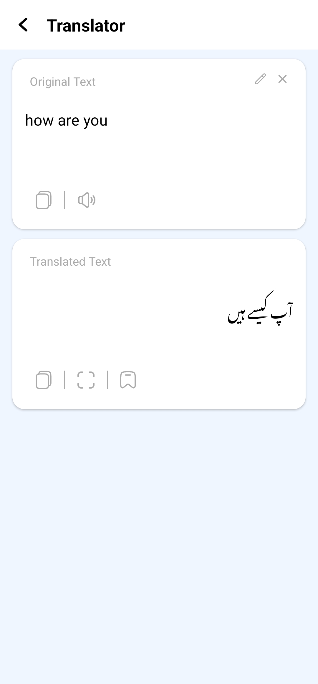 |

| History                                          | Bookmarks                                         | Settings                                          |
| ------------------------------------------------ | ------------------------------------------------- | ------------------------------------------------- |
| 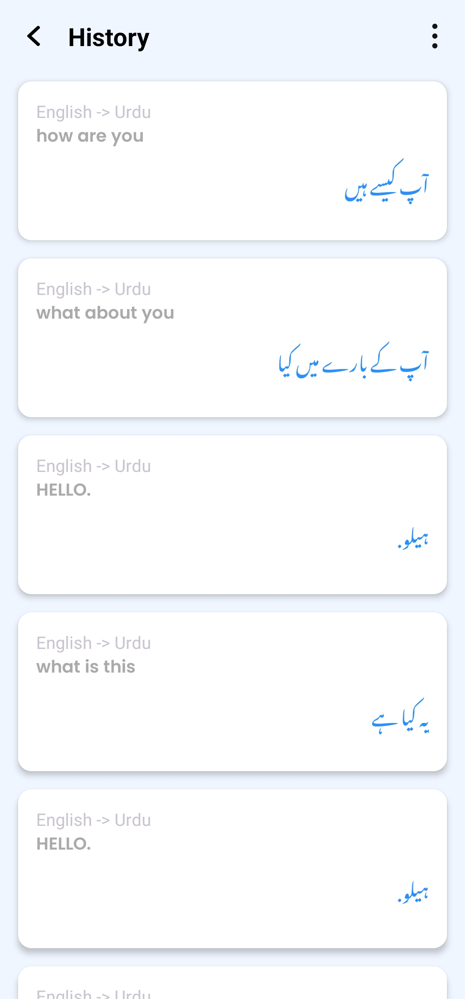 | 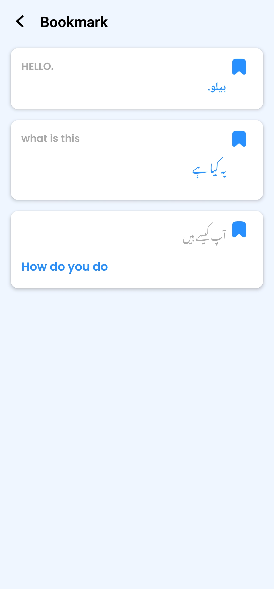 | 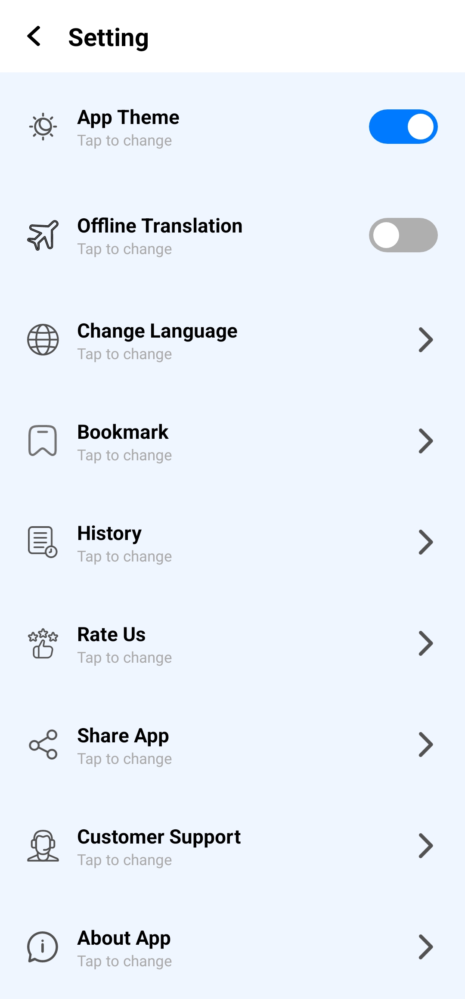 |

### Camera & Image Translation

| Live Camera                                        | Crop Screen                                     | Original Image                                       |
| -------------------------------------------------- | ----------------------------------------------- | ---------------------------------------------------- |
| 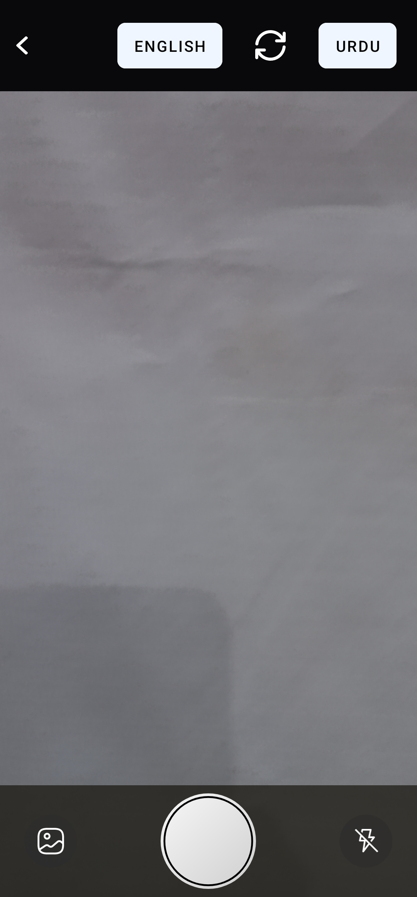 | 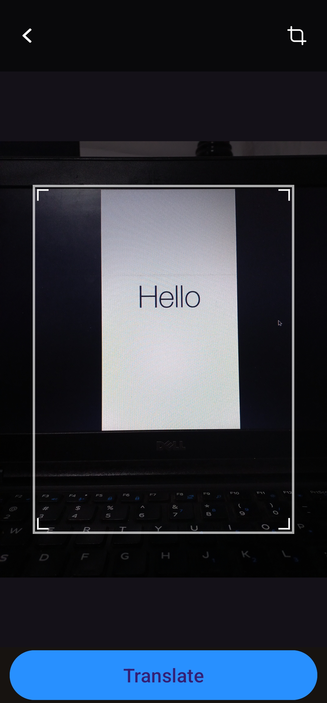 | 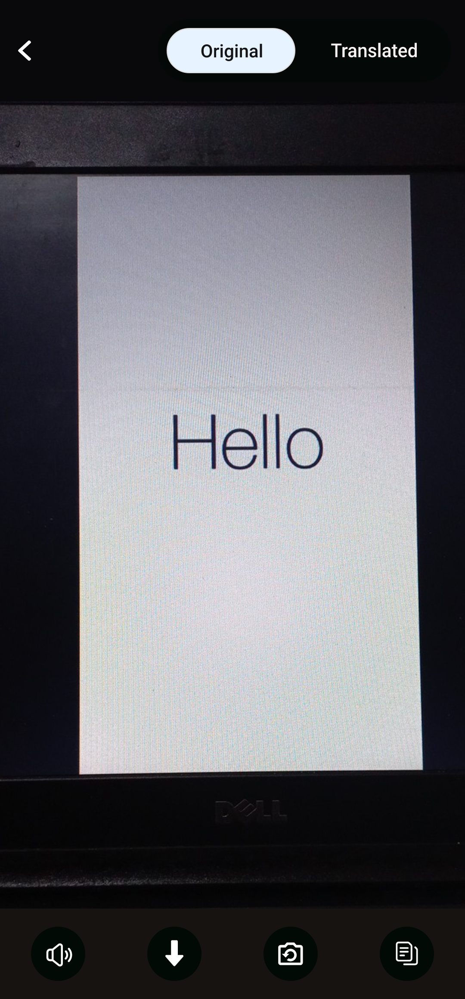 |

| Translated Image                                     |
| ---------------------------------------------------- |
| 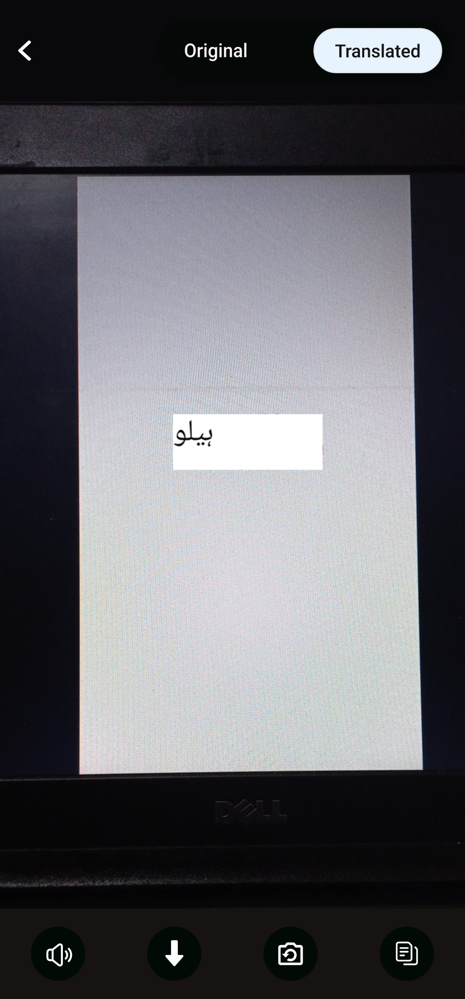 |

### Floating Widget Service

| Original Text Service                              | Translated Text Service                              |
| -------------------------------------------------- | ---------------------------------------------------- |
| 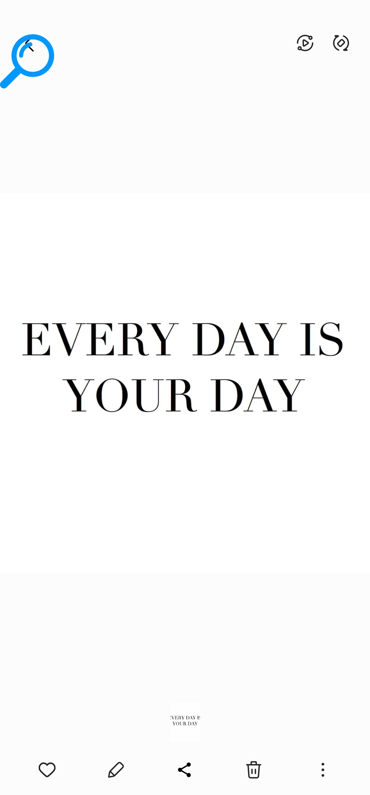 | 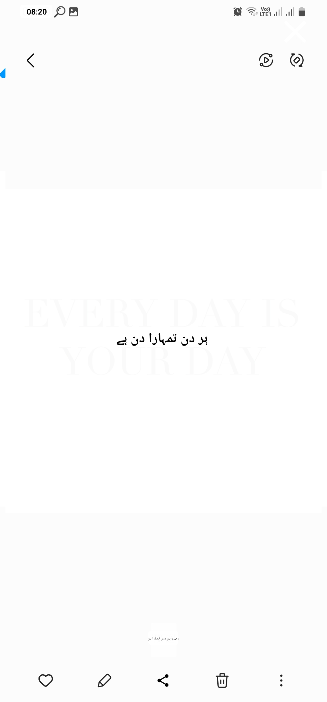 |

## 🛠️ Technologies Used

This project is built with a modern Android development tech stack:

* **Kotlin**: Primary programming language.
* **Android Jetpack**:
    * **View Binding**: To easily interact with views.
    * **LiveData & ViewModel**: For managing UI-related data in a lifecycle-conscious way.
    * **Room**: For local database storage of history and bookmarks.
    * **Navigation Component**: For handling all in-app navigation.
    * **CameraX**: For a robust and easy-to-use camera implementation.
* **Google ML Kit**: For on-device Text Recognition and Language Translation APIs.
* **Coroutines**: For managing background threads and asynchronous operations.
* **Hilt**: For dependency injection.
* **Material Components for Android**: For modern UI elements and themes.

## 🚀 Getting Started

To get a local copy up and running, follow these simple steps.

### Prerequisites

* Android Studio Iguana | 2023.2.1 or later.
* Android SDK installed and configured.
* An Android device or emulator with API level 24 or higher.

### Installation

1.  **Clone the repository:**
    ```sh
    git clone [https://github.com/asadbytes/Translator-App.git](https://github.com/asadbytes/Translator-App.git)
    ```
2.  **Open in Android Studio:**
    Open the cloned project in Android Studio.
3.  **Sync Gradle:**
    Let Android Studio sync the project and download all the required dependencies.
4.  **Run the app:**
    Click the 'Run' button to build and install the app on your device or emulator.

## 🤝 Contributing

Contributions are what make the open-source community such an amazing place to learn, inspire, and create. Any contributions you make are **greatly appreciated**.

If you have a suggestion that would make this better, please fork the repo and create a pull request. You can also simply open an issue with the tag "enhancement".

1.  Fork the Project
2.  Create your Feature Branch (`git checkout -b feature/AmazingFeature`)
3.  Commit your Changes (`git commit -m 'Add some AmazingFeature'`)
4.  Push to the Branch (`git push origin feature/AmazingFeature`)
5.  Open a Pull Request

## 📄 License

Distributed under the MIT License. See `LICENSE` for more information.

---

<p align="center">
  Made with ❤️ by asadbytes
</p>
